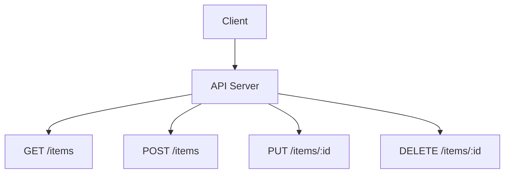
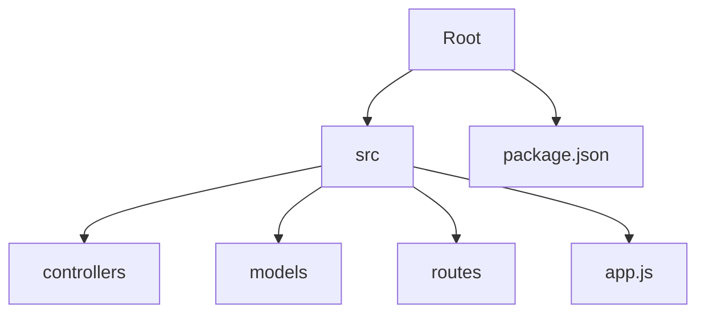

# Sample Node.js Application

This is a sample Node.js application to demonstrate basic functionality and structure.

## Features

- Simple API endpoints
- Basic CRUD operations
- Error handling
- Logging

## Installation

```bash
git clone https://github.com/yourusername/sample-nodejs-app.git
cd sample-nodejs-app
npm install
```

## Usage

```bash
npm start
```

## API Endpoints



## Project Structure



## Reference Links

- [Node.js](https://nodejs.org/)
- [Express](https://expressjs.com/)
- [npm](https://www.npmjs.com/)

## License

This project is licensed under the MIT License.